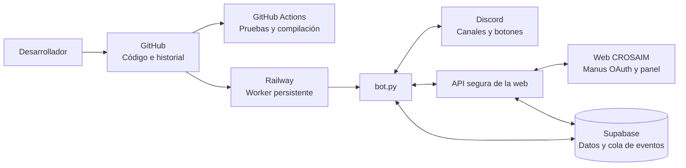

# Guion técnico de la arquitectura CROSAIM

## 1. Resumen ejecutivo

CROSAIM está compuesto por una web de operaciones, un bot de Discord, Supabase, GitHub y un servicio de ejecución persistente. En la configuración actual, **Railway mantiene vivo el bot de Discord**. GitHub conserva el código y su historial. Supabase conserva los datos operativos. La web administra jugadores, postulaciones, perfiles y eventos. Discord sirve como espacio de revisión, comunicación y operación del equipo.

Docker y `systemd` no son procesos adicionales que deban ejecutarse simultáneamente con Railway. Son alternativas de empaquetado y ejecución. El `Dockerfile` permite mover el bot a otro worker o servidor. `systemd` permite mantenerlo activo directamente en un servidor Linux. Mientras el bot continúe en Railway, Railway es el supervisor principal del proceso.

## 2. Componentes del sistema

| Componente | Función actual | Datos o responsabilidades principales |
|---|---|---|
| GitHub | Fuente central del código | Versiones, commits, ramas, pruebas y documentación |
| `bot.py` | Proceso principal del bot | Conexión a Discord, revisión, aprobación, eventos web y tareas periódicas |
| Discord | Operación del equipo | Canal de postulaciones, canal de revisión, aprobación, entrevistas, tryouts y clips |
| Supabase | Base de datos operativa | Postulaciones, estados, perfiles, eventos, auditoría y sincronización |
| Web CROSAIM | Panel de operaciones | Autenticación Manus, perfiles, scouting, contenido, torneos y cambios de estado |
| Railway | Ejecución actual 24/7 | Ejecuta el bot, mantiene el proceso activo y lo reinicia si falla |
| Docker | Empaquetado portable | Define cómo instalar dependencias y arrancar el bot en cualquier worker compatible |
| `systemd` | Supervisor alternativo | Ejecuta y reinicia el bot en un servidor Linux propio |
| GitHub Actions | Validación automática | Ejecuta pruebas y compilación en cada push o pull request |

## 3. Arquitectura general



## 4. Flujo de una postulación desde Discord

El flujo actual de Discord comienza cuando un webhook publica una postulación en el canal configurado.

```text
Webhook de Discord
    ↓
POSTULACION_CHANNEL_ID
    ↓
bot.py / on_message
    ↓
parse_submission()
    ↓
Comprobación de duplicado por ID del mensaje
    ↓
Supabase: insertar postulacion
    ↓
Web: sincronizar application desde Discord
    ↓
REVISION_CHANNEL_ID
    ↓
Moderador pulsa Aprobar o Rechazar
    ↓
Supabase: guardar estado y responsable
    ↓
Discord: publicar aprobación o rechazo
```

La protección contra duplicados utiliza el ID del mensaje de Discord y un índice único parcial en Supabase. El nombre del jugador no se utiliza como clave porque puede cambiar o repetirse.

## 5. Flujo de una postulación desde la web

Cuando la web cree una postulación, debe insertar los datos en Supabase y crear un evento pendiente para Discord.

```text
Jugador inicia sesión con Manus OAuth
    ↓
Completa o actualiza su perfil
    ↓
Web crea application_submitted
    ↓
Supabase guarda la postulación y el evento
    ↓
bot.py consulta GET /api/vant/events
    ↓
    bot.py publica datos en REVISION_CHANNEL_ID
    ↓
bot.py confirma POST /api/vant/events/{id}/ack
    ↓
Supabase marca el evento como entregado
```

Los eventos de perfil utilizan el mismo mecanismo. Los tipos admitidos por el bot son `application_submitted`, `application_created`, `profile_updated` y `player_profile_updated`. La tarjeta gráfica no es un evento: es un recurso visual opcional para una aprobación o bienvenida.

## 6. Flujo de actualización del perfil

Manus OAuth continúa siendo la identidad principal del usuario. Discord se añade como identidad vinculada.

```text
Usuario Manus
    ↓
Conectar Discord mediante Discord OAuth2
    ↓
Guardar discord_id, username y avatar
    ↓
Guardar foto, redes, rol, rango, región y disponibilidad
    ↓
Crear profile_updated en Supabase
    ↓
bot.py consume el evento
    ↓
Discord recibe la actualización en el canal de revisión
```

El perfil debe relacionarse con dos identificadores:

| Identificador | Uso |
|---|---|
| `manus_user_id` | Propietario de la cuenta y sesión principal |
| `discord_id` | Identificación del jugador en Discord y relación con postulaciones |

La web no debe reemplazar Manus OAuth hasta confirmar cómo están almacenados los usuarios actuales.

## 7. Función de `bot.py`

`bot.py` es el proceso ejecutable principal. Sus responsabilidades son:

- Conectarse al Gateway de Discord.
- Escuchar el canal de postulaciones.
- Parsear embeds, texto y adjuntos.
- Detectar postulaciones duplicadas.
- Guardar postulaciones en Supabase.
- Sincronizar postulaciones de Discord con la web.
- Publicar datos de revisión.
- Procesar botones de aprobación y rechazo.
- Generar tarjetas de bienvenida con Pillow únicamente cuando se aprueba o se necesita un anuncio visual.
- Consultar periódicamente los eventos pendientes de la web.
- Publicar entrevistas, clips, tryouts y actualizaciones de perfiles.
- Confirmar eventos entregados o fallidos.

`discord.py` intenta reconectarse al Gateway cuando una conexión se pierde. Railway aporta la capa adicional de reinicio del proceso si Python termina o el contenedor falla.

## 8. Función de Supabase

Supabase es la fuente persistente de datos. El bot usa `SUPABASE_SERVICE_ROLE_KEY` únicamente en el entorno del servidor.

Las entidades principales son:

| Entidad | Propósito |
|---|---|
| `postulaciones` | Datos, estado y mensajes Discord de cada candidato |
| `player_profiles` | Foto, redes, disponibilidad y datos del perfil |
| `discord_events` | Cola de eventos entre la web y Discord |
| `audit_log` | Registro de cambios y responsables |

La clave `SUPABASE_SERVICE_ROLE_KEY` no debe aparecer en JavaScript del navegador, GitHub, Dockerfile, logs ni archivos compartidos.

## 9. Función de GitHub

GitHub es la fuente de verdad del código, no el servidor de ejecución ni la base de datos. Cada cambio debe seguir este flujo:

```text
Modificar código localmente
    ↓
Ejecutar pytest y compileall
    ↓
Revisar git diff y git diff --check
    ↓
Crear commit descriptivo
    ↓
Push a main o crear pull request
    ↓
GitHub Actions valida el cambio
    ↓
Railway despliega según su configuración
```

GitHub debe almacenar:

- Código Python.
- Esquemas SQL y migraciones.
- Dockerfile.
- Workflows de CI.
- Documentación.
- Pruebas unitarias.
- Configuración no secreta.

GitHub no debe almacenar:

- `DISCORD_BOT_TOKEN`.
- `SUPABASE_SERVICE_ROLE_KEY`.
- `CROSAIM_BOT_SYNC_SECRET`.
- Archivos `.env`.
- Tokens OAuth.
- Datos personales exportados de jugadores.

## 10. Función de Railway

Railway es actualmente el servicio que mantiene vivo el bot. Su responsabilidad es:

1. Descargar o recibir el código del repositorio.
2. Instalar las dependencias de `requirements.txt`.
3. Ejecutar `python bot.py`, directamente o mediante el `Dockerfile`.
4. Inyectar las variables de entorno.
5. Reiniciar el proceso cuando el contenedor falle.
6. Mostrar logs de ejecución.

Variables necesarias en Railway:

```env
DISCORD_BOT_TOKEN=valor-secreto
GUILD_ID=id-del-servidor
POSTULACION_CHANNEL_ID=id-del-canal
REVISION_CHANNEL_ID=id-del-canal
APROBACION_CHANNEL_ID=id-del-canal
SUPABASE_URL=https://proyecto.supabase.co
SUPABASE_SERVICE_ROLE_KEY=valor-secreto
VANT_WEB_BASE_URL=https://crosaimweb-imugysk4.manus.space
VANT_BOT_SYNC_SECRET=valor-secreto
VANT_SIGNED_SYNC_REQUIRED=true
CLIPS_CHANNEL_ID=id-del-canal
INTERVIEW_VOICE_CHANNEL_ID=id-del-canal
INTERVIEW_NOTICE_CHANNEL_ID=id-del-canal
```

El nombre exacto de cada variable debe coincidir con el código. Railway debe utilizar una política de reinicio automática y un worker persistente, no un servicio web que se duerma.

## 11. Función de Docker

Docker empaqueta el entorno del bot de forma reproducible. El `Dockerfile` instala Python, dependencias y ejecuta `bot.py`.

Docker puede utilizarse en Railway o en otro proveedor compatible. No es necesario ejecutar Docker localmente de forma permanente si Railway ya construye y ejecuta la imagen.

## 12. Función de `systemd`

`systemd` es una alternativa a Railway. Solo se usaría si el bot se mueve a un servidor Linux administrado por el equipo.

```text
Railway + worker persistente = configuración actual
Servidor Linux + systemd = alternativa futura
Servidor Linux + Docker = alternativa portable
```

No se recomienda ejecutar simultáneamente el mismo bot en Railway y `systemd`, porque ambos procesos recibirían eventos y podrían duplicar mensajes en Discord.

## 13. Resiliencia y seguridad

El sistema debe separar la resiliencia de la aplicación y la resiliencia del hosting.

| Capa | Mecanismo |
|---|---|
| Discord | Reconexión automática de `discord.py` |
| Código | `try/except`, logs y ACK de eventos |
| Supabase | Índices únicos, estados persistentes y copias de seguridad |
| Web | Cola de eventos con reintentos |
| Railway | Reinicio automático del worker |
| GitHub | Historial, revisión y CI |
| Secretos | Variables de entorno del proveedor |

La cola web debe utilizar una clave de idempotencia. Un evento fallido debe conservarse para reintento. Un evento confirmado no debe volver a publicarse.

## 14. Estado actual y siguiente etapa

Actualmente están versionados en `feispla/CROSAIM.GG` el bot, la deduplicación, las pruebas, el `Dockerfile`, el workflow de CI y el contrato de sincronización. Railway mantiene la ejecución del bot.

La siguiente etapa requiere el código fuente de la web para implementar el lado productor de eventos: perfil del jugador, conexión Discord OAuth2, almacenamiento de `discord_id`, creación de eventos en Supabase y publicación de actualizaciones hacia el bot.

Hasta que ese código esté disponible, el bot ya está preparado para recibir los tipos de eventos web definidos en este documento, pero la web todavía debe generarlos.

## Referencias

[1]: https://discord.com/developers/docs/topics/gateway "Discord Gateway Documentation"
[2]: https://discordpy.readthedocs.io/en/stable/ "discord.py Documentation"
[3]: https://docs.railway.com/ "Railway Documentation"
[4]: https://supabase.com/docs "Supabase Documentation"
[5]: https://docs.github.com/en/actions "GitHub Actions Documentation"
